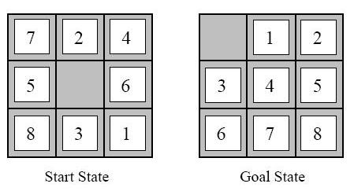

# Tiledriver

Project for CSC 480 (Aritificial Intelligence) 

Tiledriver - Solving the sliding tile puzzle using the A* Search algorithm and priority queue.

Tiledriver II - Create solvable sliding tile puzzles with a specified minimum number of moves to find the solution using uphill climibing and simulated annealing.

The size of the puzzles can be either 3x3 or 4x4. In the case of a 4x4 that 2.09x10^13 possible states.

TILEDRIVER

In this project I defined 2 main classes:

TilePuzzle:
  - width : defines the size of the matrix (size = 9 -> width = 3)
  - start_state : starting state of the puzzle
  - frontier : priority queue that holds the valid frontier states.

State:
  - tiles : current arrangement of the tiles
  - path : the set of moves to get from the starting state to this arrangement of tiles
  - h : approximation from current state to goal state using Manhattan distance and linear conflicts
  - f : number of moves made from start + h

TILEDRIVER II

Nearly half of the possible configurations of the sliding tile puzzle aren't solvable! Any configuration that is created by shifting tiles from a solved state will produce a solvable puzzle, but this is inefficient at creating configurations with solutions of a specific number of moves.

To minimize time complexity I used a simulated anneaing algorithm and an uphill climbing algorithm with random restarts to increase exploration.

**The Heuristic class and _count_inversions was given to me by my professor, but the rest was written exclusively by me.**
